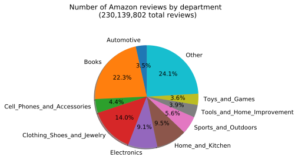

# Amazon product recommender

### Introduction

An effective recommender system is a critical part of successful e-commerce. Amazon.com attributes 35% of its revenue to its complex recommendation system. [source: https://www.mckinsey.com/industries/retail/our-insights/how-retailers-can-keep-up-with-consumers] Modern data science techniques enable recommendations from data including but not limited to shopping history, ratings (explicit and implicit), and website activity (types of web pages visited and duration on those web pages, exit rates, etc.) using techniques such as Singular Value Decomposition (SVD) on user-rating data and cosine similarity on vectorized item descriptions. 

To get acquainted with the data, as of 2018, Amazon had ~15.2 million products across 29 departments, with ~230.1 million reviews in total. The largest departments in terms of reviews and products were 'Books' and 'Clothing Shoes and Jewelry' (see the following two figures).

<table align="center">
<tr>
  <td></td><td></td>
  </tr>
</table>

Interestingly, due to the steep rise in review count in about 2014, the majority of Amazon's reviews may be from this time onwards despite the website opening in 1997. The following figure shows the total review count for several selected departments.

Amazon's product ratings distribution mostly occupies the extremes (1 or 5 on a 1-5 scale), which is a <a href="http://www.columbia.edu/~on2110/Papers/Schoenmueller_netzer_stahl_2018.pdf">known phenomenon in the distribution of online reviews</a>. The reasons could be due to a tendency only for those with extreme experiences to be likely to provide a review. This type of distribution is apparent for Amazon: the following violin plot shows the ratings distribution for all products, as well as some of the individual departments that comprise the total distribution.

## Recommendations from collaborative filtering techniques

The first approach in this project was to use publicly available data comprised of product reviews and meta data from Amazon collected in 2018 to create a collaborative-filtering based recommender system via a commandline program. This approach used the '5-core' review datasets (where every reviewer and every product has at least 5 reviews) and meta data for all products in all departments. Given a user input of product ratings, the goal was to provide recommendations for each department a user rated products in.

The basic process goes as:
1. Take in user input of ratings 
2. Detect which departments the products belong to
3. Fit a separate model with all users and rating data for each department, which include the user's
4. Return recommendations for each department 

### Usage

The recommender is given in src/recommender.py

usage: python recommender.py user_input.csv

"user_input.csv" is a csv file (without headers) with product asins on the left column and ratings in the right column (an example is provided in this directory as sample_submissions.csv)

Data source: https://nijianmo.github.io/amazon/index.html

A script for helping to collect the data and recreate the mongo database used in the project is provided in src/data_collection.py

Samples of ratings and meta data for Software are provided in the data directory. 

Additional necessary files (asins.csv) provided here: https://drive.google.com/file/d/1KoXFwZ84JS13kRM1MaQIYG3oNo2eqjVp/view?usp=sharing

### Model evaluation 

A script for model evaluation is given in src/modelling.py

Models (all at default settings):
SVD and NMF (from the Surprise scikit) with user ratings;
XGBoost with user ratings and TFIDF-transformed 'bags of words' with description, features, brand, and category text;
Cosine similarity on the TFIDF transformations

Metrics:
Overall RMSD and RMSD for products predicted to be in top 5% of ratings per user (SVD, NMF, XGBoost);
Average actual rating for products predicted to be in the top 5% of ratings or similarity per user (all models)

The Video Games, Musical Instruments, Software, Arts Crafts and Sewing, Industrial and Scientific, and Grocery and Gourmet Food departments were used in model evaluation. Data was split in half by time per department and models trained and tested on the earlier and later halves, respectively. The scores for the test portions for each model and metric is shown in the following figures (note that RMSD could not be tested for cosine similarity because that calculates a value between -1 and 1 and not an explicit rating):

SVD had the lowest RMSD results of any method, while for the actual ratings of top 5% predicted products, the XGBoost method performed best except in Musical Instruments and Software (tied in Grocery and Gourmet Food). XGBoost, despite its higher RMSD, may be predicting more products that the user ended up rated highly, except in the above mentioned departments. The better or worse ability of XGBoost to predict enjoyable products may depend on the usefulness of the text data utilized, which SVD does not rely upon.

The current version of this recommender uses the SVD model, partly because the wall time for execution is less than the XGBoost method with only a small compromise in scores of the top 5% of predicted products.

## Recommendations from content-based filtering techniques

Recommendations from a user profile of inputted ratings seems to perform well, but the drawbacks of the commandline approach above is the computation time to get the recommendations. What if the user just wanted to know which products are similar to a specific product? This inspired the creation of a web app with a database of pre-computed product similarities using the TFIDF+cosine similarity method. The web app based on this idea is hosted <a href="https://tjs-apr.herokuapp.com">here</a>.

# Future directions

To further explore recommendations computed 'on-the-fly' in the commandline approach, more departments could be used in model evaluation (preferably, all of them), and the tendency for XGBoost to predict more products that the user would enjoy despite higher overall RMSD should be investigated. Overall, this should give good recommendations due to the ability of taking in a potentially large user profile of inputted ratings, but the computation time is slow. On the other hand, the web app which provides recommendations on the basis of cosine similarity on TFIDF-transformed text data could be used to obtain recommendations more quickly, to find products similar to a particular product that the user enjoyed. However, the recommendations of the web app have yet to be thoroughly tested with metrics like the above used in the commandline approach. In principle, it should be possible to compute recommendations based on a single product using any method (content or collaboritive-based techniques), so the method used in the web app is liable to change pending thorough testing of the recommendations produced from an input of a single product.

